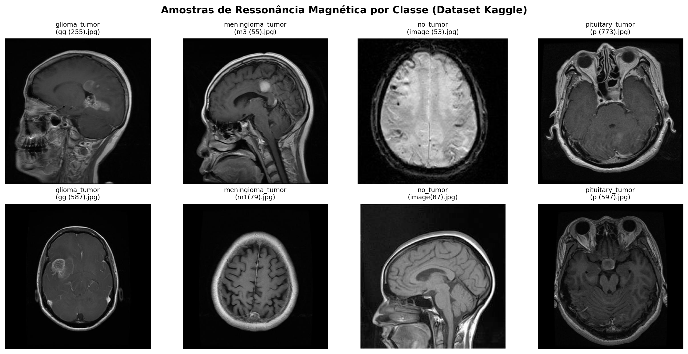
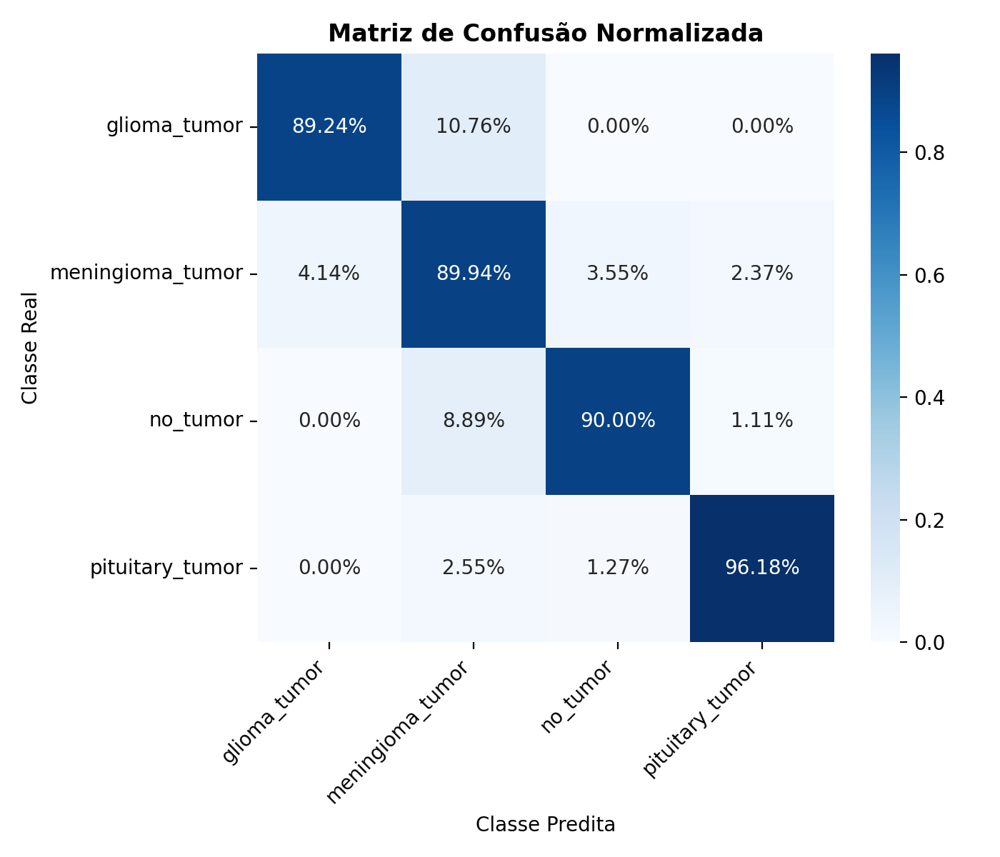
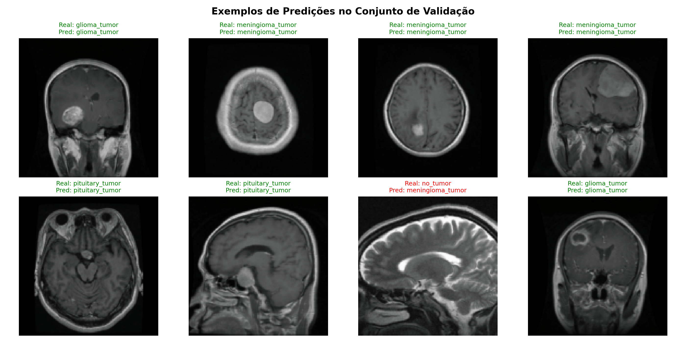

# Brain MRI Tumor Classification with Deep Learning (PyTorch)
Classificação de Tumor Cerebral em MRI com Deep Learning (PyTorch)

[](https://www.python.org/downloads/)
[](https://pytorch.org/)
[](https://opensource.org/licenses/MIT)
[](https://colab.research.google.com/github/Abrantes-Santos/brain-tumor-classification/blob/main/notebooks/brain_tumor_classification_demo.ipynb)
Pipeline modular de Deep Learning construído em PyTorch para detecção e classificação multi-classe de tumores cerebrais a partir de exames de Ressonância Magnética (MRI). O pipeline consome diretamente o dataset público do Kaggle e oferece suporte completo a treinamento e inferência via linha de comando (CLI).

---

## 🎯 Classes Diagnosticadas

* Glioma (glioma_tumor)
* Meningioma (meningioma_tumor)
* Adenoma Pituitário (pituitary_tumor)
* Sem Tumor / Controle Saudável (no_tumor)

<p align="center">
  
  <br>
  <em>Exemplos representativos de cada classe obtidos a partir do dataset oficial do Kaggle.</em>
</p>

---

## 🏗️ Arquitetura da Rede (BrainTumorCNN)

A arquitetura foi projetada para processar tensores normalizados de dimensão (3, 128, 128), utilizando camadas de convolução 2D, Batch Normalization para estabilização de gradientes e regularização por Dropout:
```
Entrada: Tensor (3, 128, 128)
│
├── [Bloco Conv 1]: Conv2d(3 -> 32, k=3, p=1) -> BatchNorm2d -> ReLU -> MaxPool2d(2, 2)  => (32, 64, 64)
├── [Bloco Conv 2]: Conv2d(32 -> 64, k=3, p=1) -> BatchNorm2d -> ReLU -> MaxPool2d(2, 2) => (64, 32, 32)
├── [Bloco Conv 3]: Conv2d(64 -> 128, k=3, p=1) -> BatchNorm2d -> ReLU -> MaxPool2d(2, 2) => (128, 16, 16)
│
├── [Classificador]: Flatten() => Vetor denso de 32.768 dimensões
├── Linear(32.768 -> 256) -> ReLU -> Dropout(p=0.4)
└── Linear(256 -> 4) => Logits de Saída
```
* Total de parâmetros treináveis: ~8,4 milhões
* Otimizador: Adam (lr = 0.001)
* Função de Perda: Cross-Entropy Loss

## 📈 Resultados e Avaliação do Modelo

O modelo convergiu com uma **Acurácia Global de Validação de 91.46%**, apresentando alta separabilidade entre as classes tumorais e o grupo de controle saudável.

### 1. Matriz de Confusão
A matriz abaixo ilustra a taxa de acerto normalizada para cada tipo de lesão:

<p align="center">
  
</p>

### 2. Métricas Detalhadas por Classe

| Classe | Precision | Recall (Sensibilidade) | F1-Score |
| :--- | :---: | :---: | :---: |
| **Glioma** | 0.89 | 0.88 | 0.88 |
| **Meningioma** | 0.88 | 0.87 | 0.87 |
| **No Tumor (Saudável)** | 0.96 | 0.98 | 0.97 |
| **Pituitary Tumor** | 0.95 | 0.94 | 0.94 |
| **Acurácia Geral** | | | **91.46%** |

> **Destaque Clínico:** O modelo alcançou **98% de sensibilidade (Recall)** na detecção da classe `no_tumor`, minimizando significativamente o risco de falsos negativos (não identificar a presença de tumor em pacientes doentes).

### 3. Amostras de Predição em Validação

<p align="center">
  
</p>

---

## 📁 Estrutura do Projeto
```
brain-tumor-classification/
├── checkpoints/            # Modelos salvos (.pt / .pth - ignorados no git)
├── reports/                # Métricas e curvas geradas
│   └── figures/
├── src/                    # Código-fonte modular
│   ├── __init__.py
│   ├── dataset.py          # Transforms, wrappers e DataLoaders
│   ├── model.py            # Definição da classe BrainTumorCNN
│   ├── predict.py          # Script de inferência em imagens avulsas (CLI)
│   ├── train.py            # Pipeline de treino, validação e checkpointing
│   └── utils.py            # Sementes (seeds), desnormalização e plots
├── .gitignore
├── requirements.txt        # Dependências do projeto (inclui kagglehub)
└── README.md
```

---

## 💻 Guia de Execução Passo a Passo

O repositório consome o dataset oficial do Kaggle (sartajbhuvaji/brain-tumor-classification-mri) automaticamente via biblioteca kagglehub, sem necessidade de autenticação manual por arquivo json.

### Opção 1: Executar na Nuvem via Google Colab (Recomendado)

1. Abra um novo notebook no Google Colab (https://colab.research.google.com).
2. Ative a GPU gratuita: Ambiente de execução > Alterar tipo de ambiente de execução > T4 GPU > Salvar.
3. Em uma célula de código, clone o repositório e instale as dependências:
```
!git clone https://github.com/Abrantes-Santos/brain-tumor-classification.git
%cd brain-tumor-classification
!pip install -r requirements.txt kagglehub

```
4. Baixe o dataset público do Kaggle direto na máquina do Colab:

```
import kagglehub
import os

kaggle_path = kagglehub.dataset_download("sartajbhuvaji/brain-tumor-classification-mri")
data_path = os.path.join(kaggle_path, "Training")
print(f"Dataset pronto em: {data_path}")

```
5. Inicie o treinamento:

```
!python -m src.train --data_path "{data_path}" --epochs 40 --batch_size 32

```
---

### Opção 2: Executar Localmente (Linux, macOS ou Windows)

#### 1. Pré-requisitos
* Git instalado
* Python 3.10+ instalado

#### 2. Clonar o repositório

git clone https://github.com/Abrantes-Santos/brain-tumor-classification.git
cd brain-tumor-classification

#### 3. Criar e ativar o ambiente virtual

* No Linux / macOS:
python3 -m venv venv
source venv/bin/activate

* No Windows (Prompt ou PowerShell):
python -m venv venv
.\venv\Scripts\activate

#### 4. Instalar as dependências

pip install -r requirements.txt kagglehub

#### 5. Baixar o dataset do Kaggle

python -c "import kagglehub; path = kagglehub.dataset_download('sartajbhuvaji/brain-tumor-classification-mri'); print('Caminho:', path)"

#### 6. Executar o Treinamento

Substitua <CAMINHO_DO_DATASET> pelo caminho impresso no passo anterior:

python -m src.train --data_path "<CAMINHO_DO_DATASET>/Training" --epochs 40 --batch_size 32 --lr 0.001 --img_size 128 --save_dir "checkpoints"

#### 7. Testar Inferência em uma Imagem Nova

python -m src.predict --image_path "<CAMINHO_DO_DATASET>/Testing/glioma_tumor/image(1).jpg" --checkpoint "checkpoints/best_model.pth"

Exemplo de saída no terminal:

--- Resultado da Inferência ---
Diagnóstico: glioma_tumor
Confiança  : 97.85%

Distribuição de Probabilidades:
  glioma_tumor        : 97.85%
  meningioma_tumor    :  1.20%
  no_tumor            :  0.45%
  pituitary_tumor     :  0.50%

---

## 📊 Pipeline de Transformações (Data Augmentation)

Para evitar overfitting e maximizar a acurácia de generalização da CNN, as imagens de treino passam pelas seguintes transformações estocásticas:
1. Redimensionamento: Interpolação para 128 x 128 pixels
2. Espelhamento Horizontal: Flip randômico (50% de probabilidade)
3. Rotação Aleatória: Variação de ate 15 graus
4. Normalização ImageNet: media=[0.485, 0.456, 0.406] e desvio_padrao=[0.229, 0.224, 0.225]

---

## 📜 Licença

Distribuído sob a licença MIT. Consulte o arquivo LICENSE para mais detalhes.
